+++
title = "APIサーバ構築"
outputs = ["Reveal"]
+++

## APIサーバ構築

---

{}

### 1. APIサーバについて
- WebサーバとDB間での処理
- 実際に予約処理を行う  
（DBに接続し、情報の取得や書き込み行う）
- 情報をWebサーバに受け渡して表示させる

---

#### APIサーバの動作イメージ

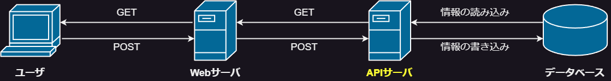

{}

---

### 2. API処理の主な内容

- 予約処理  
（在庫情報のGET、注文情報のPOST）

- 予約管理  
（予約の終了、キャンセル処理）

- 在庫管理  
（在庫情報の更新・挿入・削除）

- スケジュール管理  
（予約の終了時刻を監視）

---

{}

### 3. DBについて
- Postgresを使用
- DBとの接続にはPrismaを使用
- 正規化を意識して設計

---

#### ER図の概略  

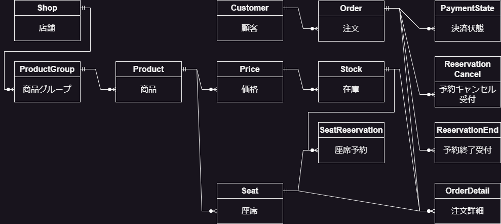

---

#### リレーショナル例　概略

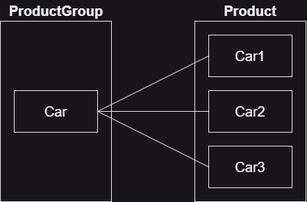

---

#### リレーショナル例

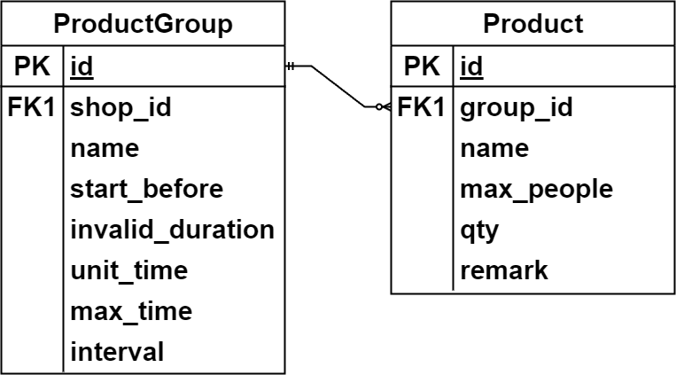

{}

---

{}

### 4. 予約処理の流れ
1. サーバがリクエストを待ち受ける
2. 商品情報を取得
3. 注文を受け取ったら処理
4. 処理の結果をレスポンスで返す

---

### 4-1. リクエスト待機
- URLでアクセスされたときに処理を開始
- 例）  
在庫情報の取得：/get_stock  
注文を送信：/post_order

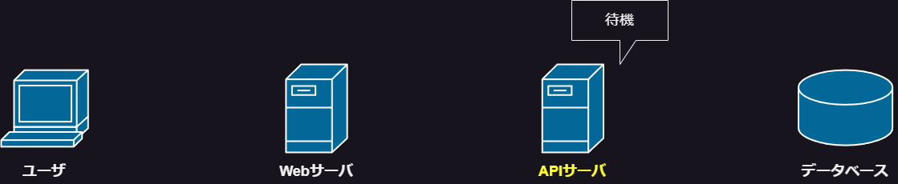

---

### 4-2. 商品情報の取得
1. ユーザが商品ページにアクセス
2. WebサーバがAPIサーバにリクエストを送信
3. APIサーバがDBにアクセスして情報を取得
4. 順にレスポンスを返す

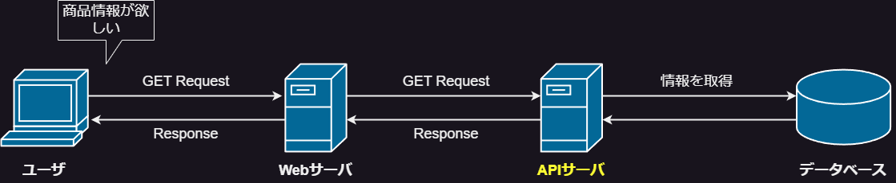

---

### 4-3. 注文処理
1. ユーザが注文情報を送信
2. WebサーバがAPIサーバにリクエストを送信
3. APIサーバがDBとやりとりして注文できるか確認

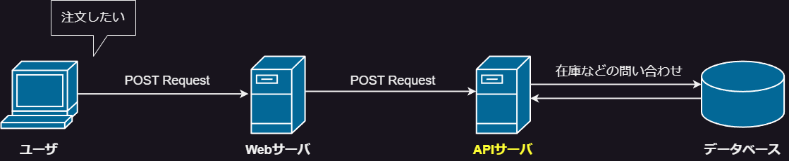

---

### 4-4. 注文結果のレスポンス
1. 注文できる場合は注文情報を登録
2. 順にレスポンスを返す

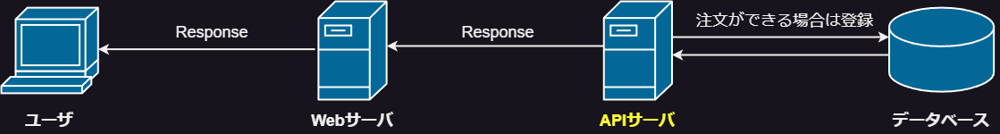

{}

---

{}

### 5. 予約処理結果
- 実際の予約処理を行った結果を示す
- リクエストの送信のためPostmanを使用  
（HTTPリクエストの送信とそれに対するレスポンスを受信できるソフトウェア）

---

### 5-1. 商品情報の取得
- /get にアクセスして商品情報を取得
- 例）Stockテーブルの価格ID=1の情報を取得
　　/get_stock?price_id=1

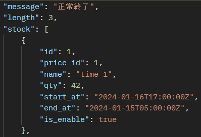

---

### 5-2. 注文の送信
- /post_orderに注文情報を送信
- 例）車の予約を想定した注文

```json
{
    "customer_id": 1, // Customer（顧客情報）テーブルID
    "start_at": "2024-01-17T09:00:00+09:00", // 予約開始時刻
    "end_at": "2024-01-17T18:00:00+09:00", // 予約終了時刻
    "remark": "text", // 備考
    "detail": [ // 注文詳細情報
        {
        "stock_id": 1, // Stock（在庫情報）テーブルID
        "qty": 1 // 数量
        }
    ]
}
```

---

### 5-3. 注文結果のレスポンス
- /post_orderに送信後、レスポンスが返される
- 成功時  
メッセージ、リクエスト内容  
登録された注文情報
- 失敗時  
メッセージ、リクエスト内容

---

#### 成功時  

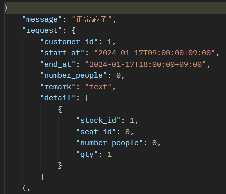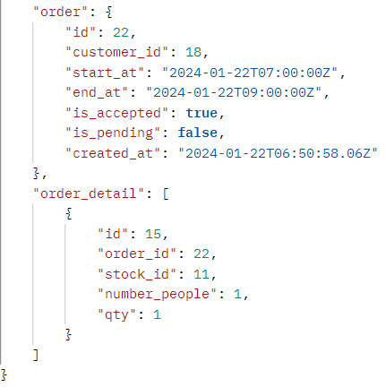

---

#### 失敗時

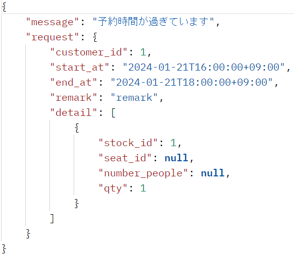

{}

---

### 6. 実演

---

### 7. 制作を通じて
- HTTPを使用した処理について知れた
- システム開発について知れた
- 汎用的な設計が難しい
- フロント（Webサーバ）との連携が難しい