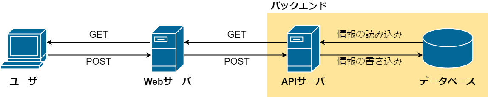
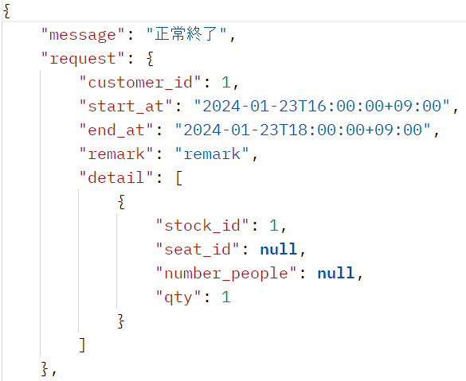
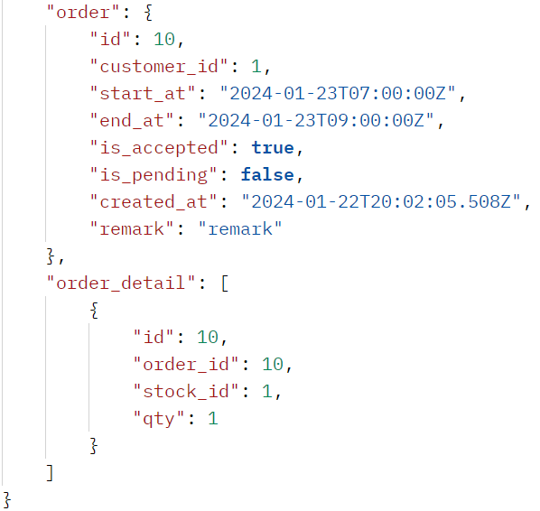

+++
title = "APIサーバ構築"
outputs = ["Reveal"]
+++

## バックエンド開発
### APIサーバ・DB構築

---

{}

### 1. APIサーバについて
- WebサーバとDB間での処理
- 実際に予約処理を行う  
（DBに接続し、情報の取得や書き込み行う）
- 情報をWebサーバに受け渡して表示させる

---

#### APIサーバの動作イメージ



{}

---

### 2. API処理の主な内容

- 予約処理  
（在庫情報の取得・注文）

- 予約管理  
（予約の終了・キャンセル）

- データベース管理  
（情報の更新・挿入・削除）

- スケジュール管理  
（予約の終了時刻を監視）

---

{}

### 3. データベースについて
- Postgresを使用
- ORMにはPrisma Go Clientを使用
- 正規化を意識して設計  
（第三正規形）

---

#### ER図の概略  


---

#### リレーショナル例　概略


---

#### リレーショナル例


{}

---

### 4. 予約処理の流れ
1. サーバがリクエストを待ち受ける
2. 商品情報を取得
3. 注文を受け取ったら処理
4. 処理の結果をレスポンスで返す

---

{}

### 5. 予約処理の結果
- 実際の予約処理を行った結果を示す
- リクエストの送信のためPostmanを使用  
（リクエストの送信とそのレスポンスを受信できるソフトウェア）

---

### 5-1. リクエスト待機
- URLでアクセスされるまで処理を待機
- URLの例）  
在庫情報の取得：/get_stock  
注文を送信：/post_order


---

### 5-2. 商品情報の取得
- ① ユーザが商品ページにアクセス
- ② WebサーバがAPIサーバにリクエストを送信
- ③ APIサーバがDBにアクセスして情報を取得
- ④⑤ 順にレスポンスを返す


---

GET: /get_stock?price_id=1


---

### 5-3. 注文処理の開始
- ① ユーザが注文情報を送信
- ② WebサーバがAPIサーバにリクエストを送信
- ③ APIサーバがDBに注文できるか確認


---

POST: /post_order body


<!-- ```json
{
    "customer_id": 1, // Customer（顧客情報）テーブルID
    "start_at": "2024-01-17T09:00:00+09:00", // 予約開始時刻
    "end_at": "2024-01-17T18:00:00+09:00", // 予約終了時刻
    "remark": "text", // 備考
    "detail": [ // 注文詳細情報
        {
        "stock_id": 1, // Stock（在庫情報）テーブルID
        "qty": 1 // 数量
        }
    ]
}
``` -->

---

### 5-4. 注文処理
- 注文内容とDBの情報を確認
- DBに情報はあるか？
- 時刻設定は正しいか？
- 在庫数は十分か？　など

---

### 5-5. 処理の終了とレスポンス
- ① 注文できる場合は注文情報を登録
- ②③ 順にレスポンスを返す


---

成功時



---

失敗時


{}

---

### 6. 制作を通じて
- HTTPを使用した処理について知れた
- DBの設計について知れた
- 汎用的な設計が難しい
- フロント（Webサーバ）との連携が難しい