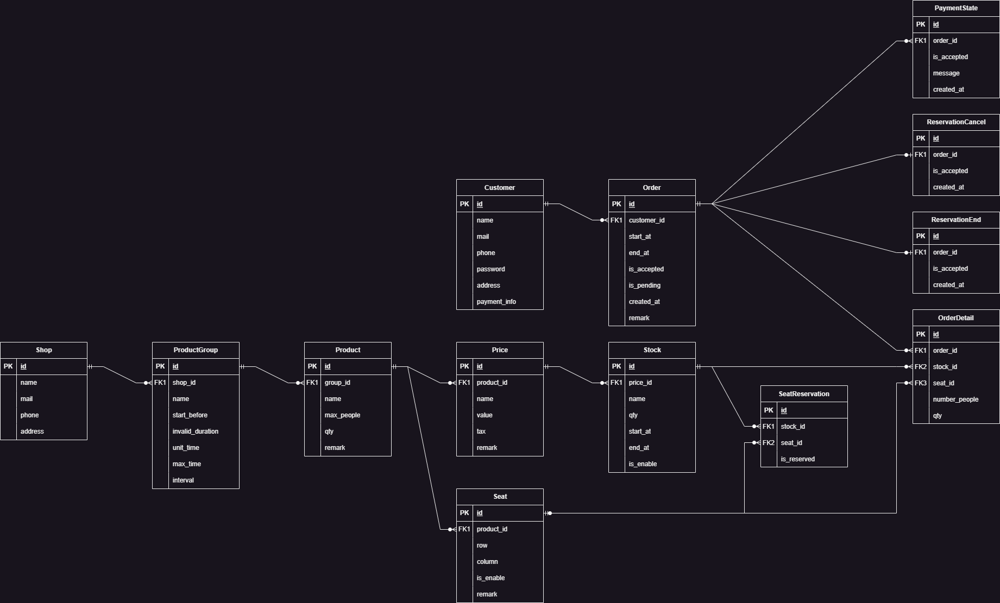

+++
title = "APIサーバ構築"
outputs = ["Reveal"]
+++

## APIサーバ構築

---

### 1. APIサーバについて
- WebサーバとDBを仲介する処理
- ユーザが
- 

- APIの動作イメージ


---

### 2. API処理の主な内容

- 予約処理  
（在庫情報のGET、注文情報のPOST）

- 在庫管理  
（在庫情報の更新・挿入・削除）

- 予約管理  
（予約の終了、キャンセル処理）

---
### 3. DBについて


---

{}

### 4. 予約処理の流れ
1. Serverがリクエストを待ち受ける
2. 商品情報を取得
3. 注文を受け取ったら処理
4. 処理の結果をレスポンスで返す


---

### 2-2. 商品情報の取得
- /get にアクセスして商品情報を取得
- 例）Stockテーブルの価格ID=1の情報を取得
　　/get_stock?price_id=1


---

### 2-3. 注文処理
- /post_orderに注文情報を送信
- 例）車の予約を想定した注文

```json
{
    "customer_id": 1, // Customer（顧客情報）テーブルID
    "start_at": "2024-01-17T09:00:00+09:00", // 予約開始時刻
    "end_at": "2024-01-17T18:00:00+09:00", // 予約終了時刻
    "remark": "text", // 備考
    "detail": [ // 注文詳細情報
        {
        "stock_id": 1, // Stock（在庫情報）テーブルID
        "qty": 1 // 数量
        }
    ]
}
```

---

### 2-4. 処理結果のレスポンス
- /post_orderに送信後、レスポンスが返される
- 成功時  
メッセージ、リクエスト内容  
登録された注文情報

- 失敗時  
メッセージ、リクエスト内容

---

- 成功時  


---

- 失敗時


{}

---

{}

### 5. 予約処理結果
- 実際の予約処理を行った結果を示す

- リクエストの送信のためPostmanを使用  
（HTTPリクエストの送信とそれに対するレスポンスを受信できるソフトウェア）

---

- Stock（在庫）テーブル


- 以下のjsonをPOSTして注文
```json
{
    "customer": 777,
    "product": 2,
    "start": "2023-11-10T10:10:00+09:00",
    "end": "2023-11-10T18:10:00+09:00",
    "num": 5
}
```
{}

---
- 注文処理後にレスポンスが返される
- 正常に注文処理が行われたことが分かる

<br>


---
- 注文後のStock（在庫）テーブル


- サーバ側のコンソール画面


---
### エラー処理
- 例）注文数が在庫数よりも多い場合
- エラーコードとメッセージが返される

<br>


---
### 4. 今後の課題
- フロントエンドとの連携

- 予約処理の時間に関する処理  
（予約間のインターバルの設定など）

- 予約料金の計算処理

- まだソフトウェアをコンテナ化できていない。

---

ご清聴ありがとうございました