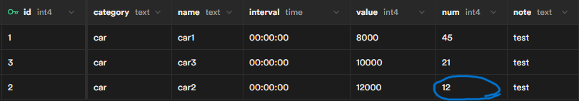

+++
title = "APIサーバ構築"
outputs = ["Reveal"]
+++

## APIサーバ構築

---
### 1. API処理の内容
- 予約処理  
（在庫情報のGET、注文情報のPOST）  

- 在庫管理  
（在庫情報の更新・挿入・削除）  

- 予約管理  
（予約の終了、キャンセル処理）  

メインとなる予約処理について説明

---
### 2. 予約処理の流れ
1. /get で在庫情報を取得
2. /post が注文を待ち受ける
3. /post が注文を受け取ったら処理
4. 処理の結果をレスポンスで返す

- APIの動作イメージ


---
### 3. 予約処理結果
- 実際の予約処理を行った結果を示す

- POSTの送信のためPostmanを使用  
（HTTPリクエストの送信とそれに対するレスポンスを受信できるソフトウェア）

---
- Stock（在庫）テーブル


- 以下のjsonをPOSTして注文
```json
{
    "customer": 777,
    "product": 2,
    "start": "2023-11-10T10:10:00+09:00",
    "end": "2023-11-10T18:10:00+09:00",
    "num": 5
}
```

---
- 注文処理後にレスポンスが返される
- 正常に注文処理が行われたことが分かる

<br>


---
- 注文後のStock（在庫）テーブル


- サーバ側のコンソール画面


---
### エラー処理
- 例）注文数が在庫数よりも多い場合
- エラーコードとメッセージが返される

<br>


---
### 4. 今後の課題
- フロントエンドとの連携

- 予約処理の時間に関する処理  
（予約間のインターバルの設定など）

- 予約料金の計算処理

- まだソフトウェアをコンテナ化できていない。

---

ご清聴ありがとうございました