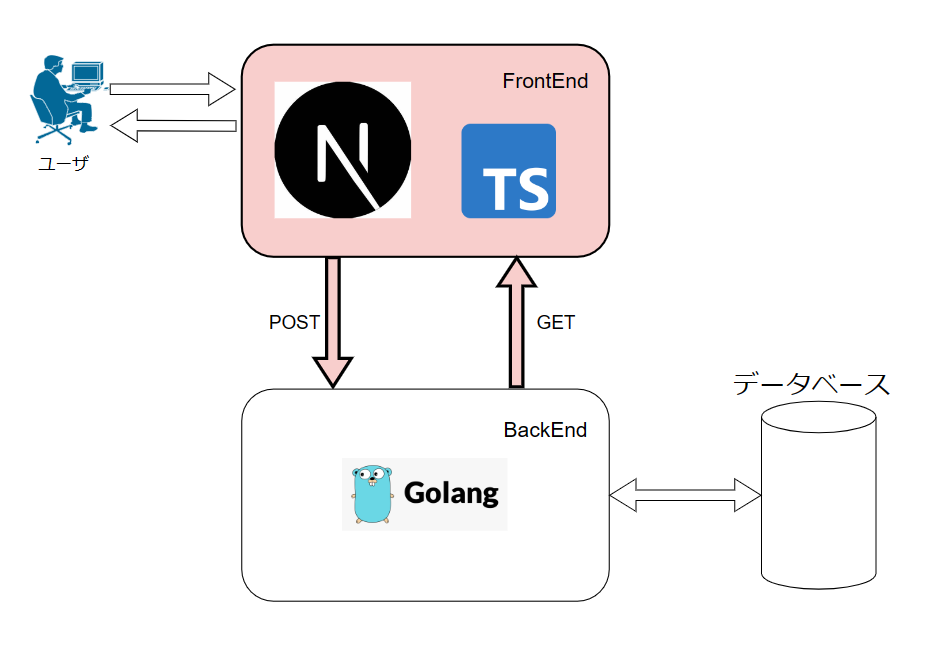
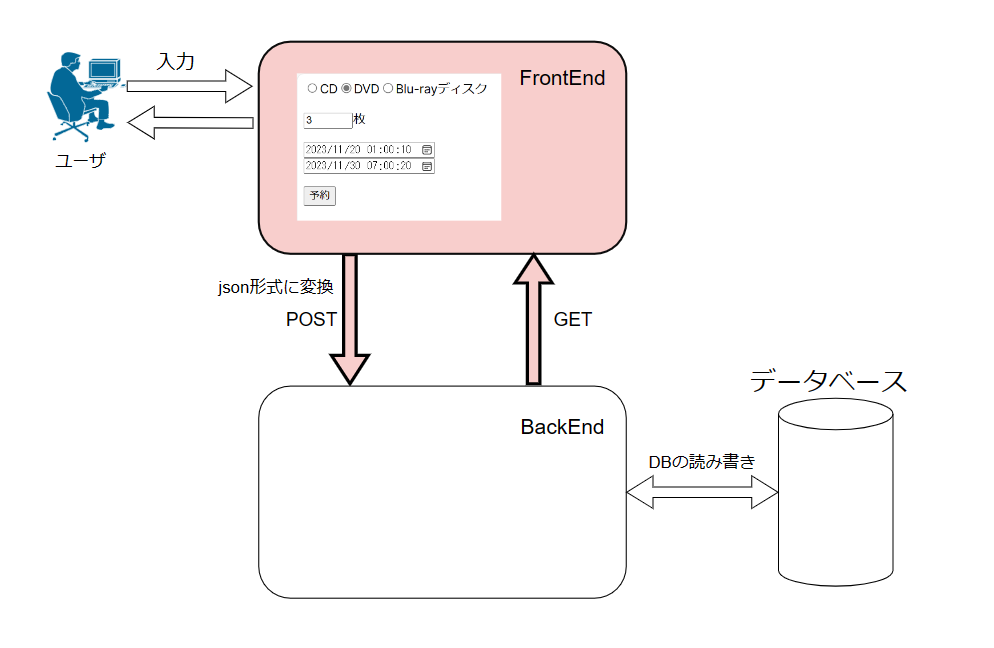
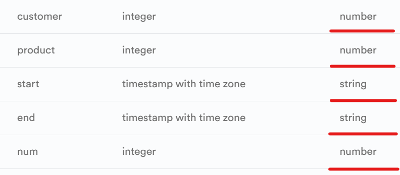
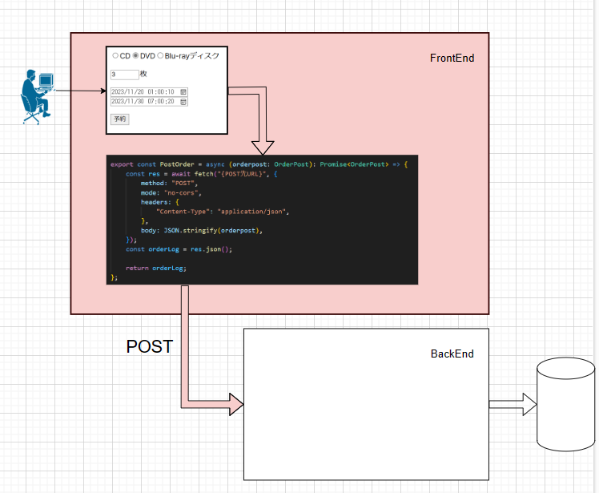

+++
title = "フロントエンドについて（Next.js）"
outputs = ["Reveal"]
+++

# フロントエンド開発
---
### 領域



---

## 1.ユーザからのアクセスを処理
---

### 処理の流れ



---

- データベースに格納されるデータの型

 

- ユーザからのアクセス(入力)で受け取る型
```
 export interface OrderPost {
    customer: number;
    product: number; 
    start: string; end: string; 
    num: number;
}
```
---

 - API先を指定してjson形式にコンパイル

 

---

### ご清聴ありがとうございました。
