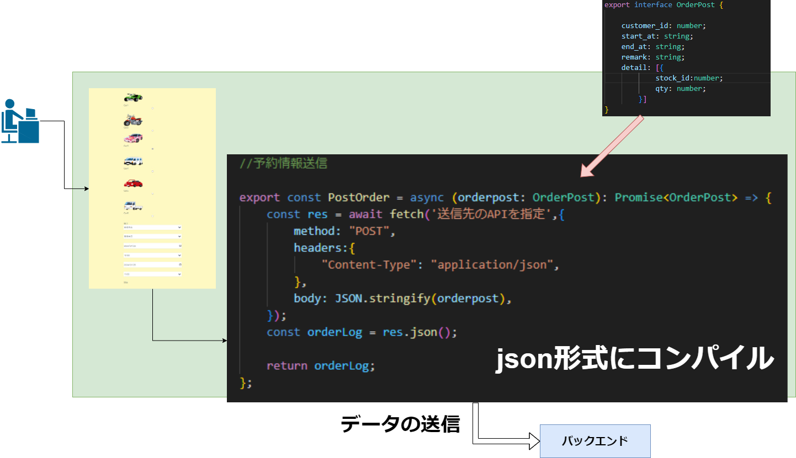
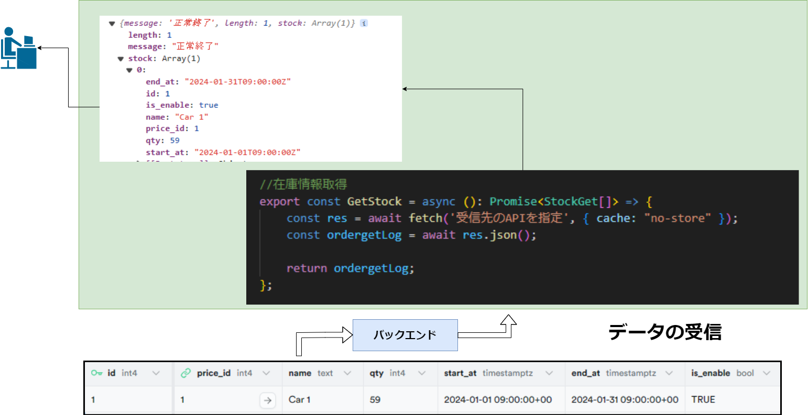

+++
title = "Nextjsフロントエンド開発"
outputs = ["Reveal"]
+++

## オムそば丼予約システム
## フロントエンド開発
---
#### 予約の流れ


---
{}
#### バックエンドへデータ送信


---
```cd
{
        "customer_id": 1,
        "start_at": "2024-01-23T10:00:00+09:00",
        "end_at": "2024-01-25T11:00:00+09:00",
        "remark": "新宿から新宿",
        "detail": [
            {
                "stock_id": 3,
                "qty": 1
            }
        ]
    }
```

{}

---

#### バックエンドからデータ受信



---

#### ユーザ登録


---

#### ユーザ登録の流れ


---
#### ユーザ登録時の認証の流れ


---
## サンプル画面の表示

 <!--実際に構築したのものを実践-->