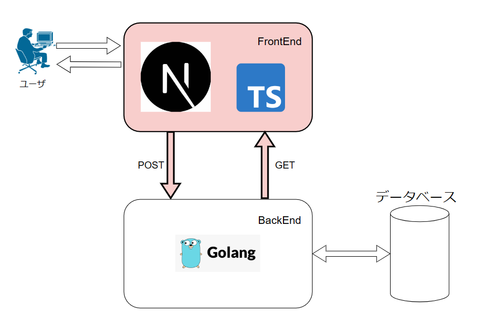
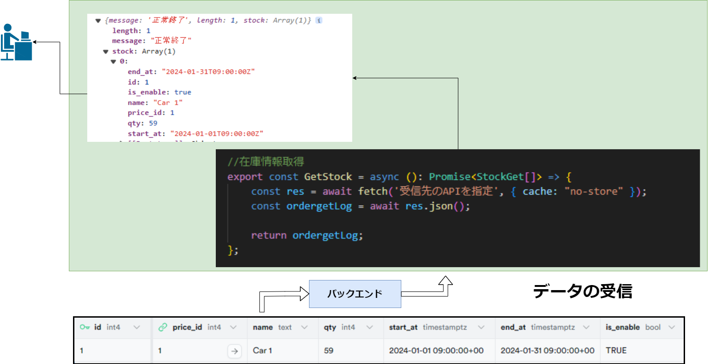
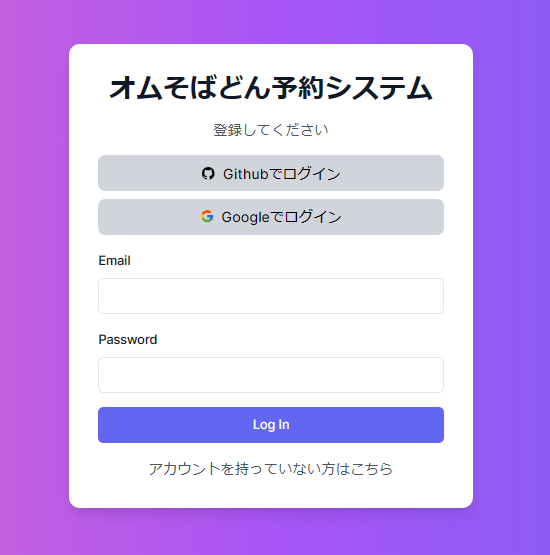
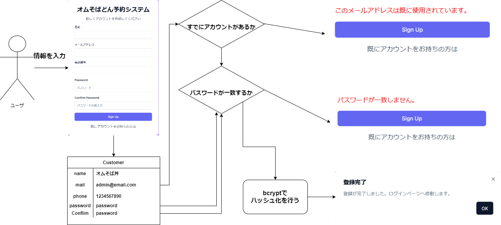
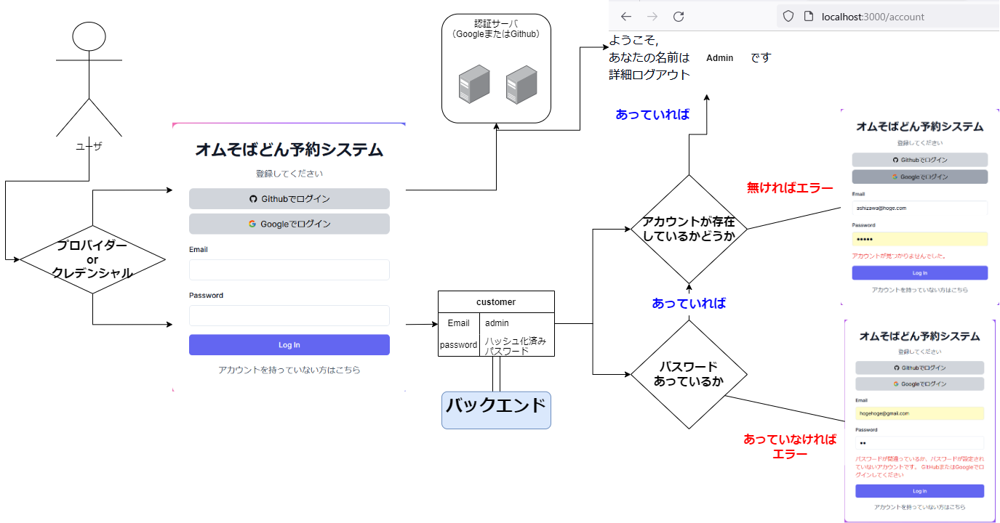

+++
title = "Nextjsフロントエンド開発"
outputs = ["Reveal"]
+++

# フロントエンド開発
---
### 予約の流れ



---

## データの送受信

---
{}
### バックエンドへデータ送信


---
```
{
        "customer_id": 1,
        "start_at": "2024-01-23T10:00:00+09:00",
        "end_at": "2024-01-25T11:00:00+09:00",
        "remark": "返却は新宿",
        "detail": [
            {
                "stock_id": 3,
                "qty": 1
            }
        ]
    }
```

{}

---

### バックエンドからデータ受信



---

## ユーザ登録
---
### ログイン画面



---

### ユーザ登録の流れ



---
### ユーザ登録時の認証の流れ



---
## デモ画面の表示

 ---
## 質疑応答
