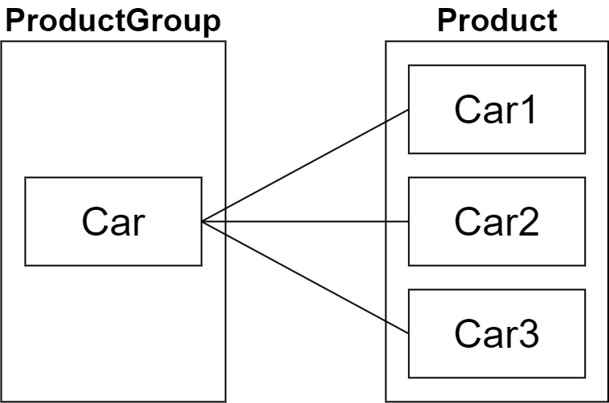
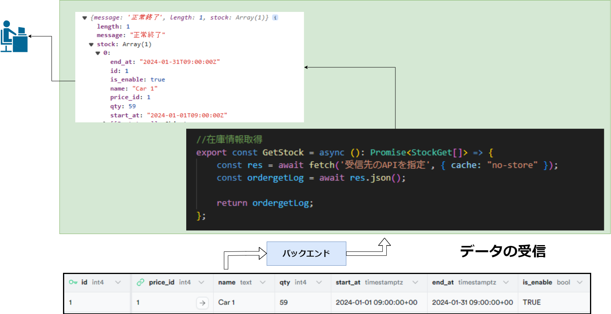

+++
title = "オムそば丼予約システム"
outputs = ["Reveal"]
+++

## オムそば丼予約システム基盤

---

### オムそば丼予約システムとは？

---

{}

## 全体設計


---

開発環境

1. 予約サイト(フロントエンド)

   - Node.js(v20.11.0 LTS)

2. ダッシュボード(フロントエンド)

   - Node.js

3. 予約システム(バックエンド)

   - Go(v1.21.5)
   - Supabase(データベース)

{}

---

### 似たようなサービスとの違いについて

- ほかにやっている人がいなかった。
- 有料または OSS ではない
- CMS であるということ（WordPress など...）

---

{}

## 実装環境について


---

- コントローラーノード：\
  3 ノード\
  （クラスタの管理と制御面、ロードバランサー MetalLB を担当）
- ワーカーノード：\
  3 ノード\
  （実際のアプリケーションワークロード実行）

{}

---

## Kubernetes とは

- Kubernetes は、コンテナオーケストレーションシステムです。
- コンテナのデプロイメント、スケーリング、管理を自動化します。

---

## k0s とは？

- k0s は、Team Lens がコミュニティと協力して作った Kubernetes の軽量ディストリビューションです。
- k3s に続く軽量な Kubernetes 実装であり機能的に柔軟です。
- 必要ない機能を排除し、軽量性を保ちリソースの制約と必要機能を考慮

---

{}

## 選定理由

1. Kubernetes が Docker デーモンを  
非推奨にしている。
2. リソース問題

---

- 当初は k8s の使用を考えていました。
- しかし、実装環境でのリソース不足により問題が発生。

クラッシュ、Pod が OOM Killer によりリスタートを繰り返すなど\
最悪の場合サーバー自体が再起動

---

## 結果


メモリの使用率が軽くなっている

↓


{}

---

## Podman について

---

## 選定理由

Go_APIServer を Kubernetes に移植する際に  
kube.yaml を一緒に作ってくれる

---

移植する際の kube.yaml


---

## 使用例

---

コンテナイメージ作る


---

kube.yaml


---

Pod 起動

```bash
kubectl apply -f kube.yaml
```

Pod が起動している


---

次はバックエンドの梅屋からの説明です。

---

## APIサーバ構築

---

{}

### 1. APIサーバについて
- WebサーバとDB間での処理
- 実際に予約処理を行う  
（DBに接続し、情報の取得や書き込み行う）
- 情報をWebサーバに受け渡して表示させる

---

#### APIサーバの動作イメージ


{}

---

### 2. API処理の主な内容

- 予約処理  
（在庫情報のGET、注文情報のPOST）

- 予約管理  
（予約の終了、キャンセル処理）

- 在庫管理  
（在庫情報の更新・挿入・削除）

- スケジュール管理  
（予約の終了時刻を監視）

---

{}

### 3. DBについて
- Postgresを使用
- DBとの接続にはPrismaを使用
- 正規化を意識して設計

---

#### ER図の概略  


---

#### リレーショナル例　概略



---

#### リレーショナル例


{}

---

{}

### 4. 予約処理の流れ
1. サーバがリクエストを待ち受ける
2. 商品情報を取得
3. 注文を受け取ったら処理
4. 処理の結果をレスポンスで返す

---

### 4-1. リクエスト待機
- URLでアクセスされたときに処理を開始
- 例）  
在庫情報の取得：/get_stock  
注文を送信：/post_order


---

### 4-2. 商品情報の取得
1. ユーザが商品ページにアクセス
2. WebサーバがAPIサーバにリクエストを送信
3. APIサーバがDBにアクセスして情報を取得
4. 順にレスポンスを返す


---

### 4-3. 注文処理
1. ユーザが注文情報を送信
2. WebサーバがAPIサーバにリクエストを送信
3. APIサーバがDBとやりとりして注文できるか確認


---

### 4-4. 注文結果のレスポンス
1. 注文できる場合は注文情報を登録
2. 順にレスポンスを返す


{}

---

{}

### 5. 予約処理結果
- 実際の予約処理を行った結果を示す
- リクエストの送信のためPostmanを使用  
（HTTPリクエストの送信とそれに対するレスポンスを受信できるソフトウェア）

---

### 5-1. 商品情報の取得
- /get にアクセスして商品情報を取得
- 例）Stockテーブルの価格ID=1の情報を取得
　　/get_stock?price_id=1


---

### 5-2. 注文の送信
- /post_orderに注文情報を送信
- 例）車の予約を想定した注文

```json
{
    "customer_id": 1, // Customer（顧客情報）テーブルID
    "start_at": "2024-01-17T09:00:00+09:00", // 予約開始時刻
    "end_at": "2024-01-17T18:00:00+09:00", // 予約終了時刻
    "remark": "text", // 備考
    "detail": [ // 注文詳細情報
        {
        "stock_id": 1, // Stock（在庫情報）テーブルID
        "qty": 1 // 数量
        }
    ]
}
```

---

### 5-3. 注文結果のレスポンス
- /post_orderに送信後、レスポンスが返される
- 成功時  
メッセージ、リクエスト内容  
登録された注文情報
- 失敗時  
メッセージ、リクエスト内容

---

#### 成功時  


---

#### 失敗時


{}

---

### 6. 実演

---

### 7. 制作を通じて
- HTTPを使用した処理について知れた
- システム開発について知れた
- 汎用的な設計が難しい
- フロント（Webサーバ）との連携が難しい

---

次はフロントエンドの石川からの説明です。

---

# フロントエンド開発

---

### 予約の流れ


---

## データの送受信

---

{}

### バックエンドへデータ送信


---

```
{
        "customer_id": 1,
        "start_at": "2024-01-23T10:00:00+09:00",
        "end_at": "2024-01-25T11:00:00+09:00",
        "remark": "返却は新宿",
        "detail": [
            {
                "stock_id": 3,
                "qty": 1
            }
        ]
    }
```

{}

---

### バックエンドからデータ受信



---

## ユーザ登録

---

### ログイン画面


---

### ユーザ登録の流れ


---

### ユーザ登録時の認証の流れ


---

## デモ画面の表示

---

## 質疑応答
