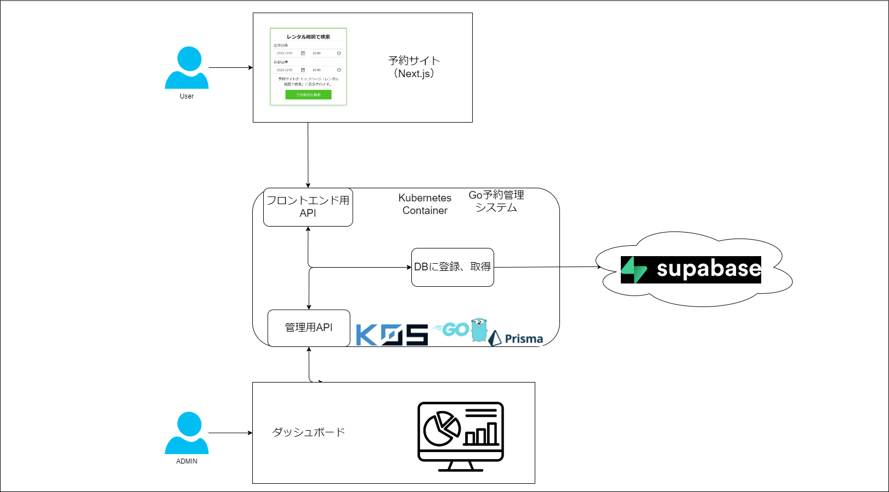

+++
title = "オムそば丼予約システム"
outputs = ["Reveal"]
+++

## オムそば丼予約システム基盤
## 中間発表
---

### オムそば丼予約システムとは？

---
## 全体設計

---

### 似たようなサービスとの違いについて
- ほかにやっている人がいなかった。
- 有料またはOSSではない
- CMSであるということ（WordPressなど...）

---
{}
## 実装環境について

---

- コントローラーノード：\
3ノード\
（クラスタの管理と制御面を担当）
- ワーカーノード：\
3ノード\
（実際のアプリケーションワークロード実行）
- ロードバランサーノード：\
1ノード\
（TraefikとMetalLBを使用して外部トラフィックのルーティングとロードバランシングを担当）

{}

---

## Kubernetesについて

---

## Kubernetesとは

- Kubernetesは、コンテナオーケストレーションシステムです。
- コンテナのデプロイメント、スケーリング、管理を自動化します。

---

## 選定理由

- 当初はk8sの使用を考えていました。
- しかし、実装環境でのリソース不足により問題が発生。

クラッシュ、PodがOOM Killerによりリスタートを繰り返すなど\
最悪の場合サーバー自体が再起動

---
## k0sとは？

- k0sは、Team Lens がコミュニティと協力して作ったKubernetesの軽量ディストリビューションです。
- k3sに続く軽量なKubernetes実装です。

---

## k0sの利点と選択

- k0sは軽量でありながら、機能的に柔軟です。
- コンテナランタイムやCNIなど、幅広い対応が可能です。
- k0sは追加型のアプローチを採用。
- 必要ない機能を排除し、軽量性を保ちつつk8sの機能を利用できます。
- リソースの制約と必要機能を考慮し、k0sを選定しました。
- k0sはk8sの強力な代替品として機能します。
---

次はフロントエンドの石川からの説明です。
