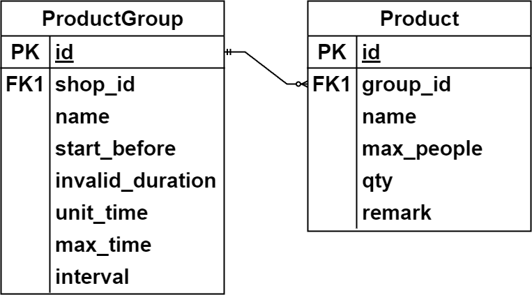
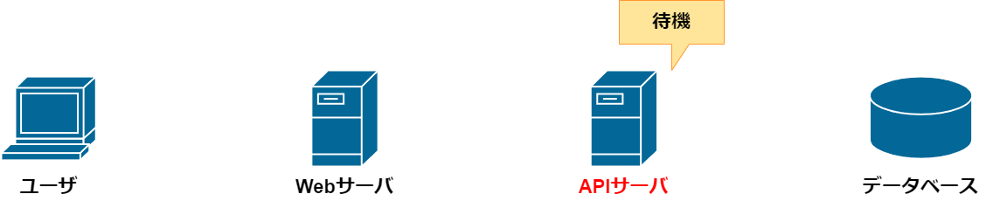

+++
title = "オムそば丼予約システム"
outputs = ["Reveal"]
+++

## オムそば丼予約システム基盤

---

### オムそば丼予約システムとは？

---

{}

## 全体設計


---

開発環境

1. 予約サイト(フロントエンド)

   - Node.js(v20.11.0 LTS)

2. ダッシュボード(フロントエンド)

   - Node.js

3. 予約システム(バックエンド)

   - Go(v1.21.5)
   - Supabase(データベース)

{}

---

### 似たようなサービスとの違いについて

- ほかにやっている人がいなかった。
- 有料または OSS ではない
- CMS であるということ（WordPress など...）

---

{}

## 実装環境について


---

- コントローラーノード：\
  3 ノード\
  （クラスタの管理と制御面、ロードバランサー MetalLB を担当）
- ワーカーノード：\
  3 ノード\
  （実際のアプリケーションワークロード実行）

{}

---

## Kubernetes とは

- Kubernetes は、コンテナオーケストレーションシステムです。
- コンテナのデプロイメント、スケーリング、管理を自動化します。

---

## k0s とは？

- k0s は、Team Lens がコミュニティと協力して作った Kubernetes の軽量ディストリビューションです。
- k3s に続く軽量な Kubernetes 実装であり機能的に柔軟です。
- 必要ない機能を排除し、軽量性を保ちリソースの制約と必要機能を考慮

---

{}

## 選定理由

1. Kubernetes が Docker デーモンを  
非推奨にしている。
2. リソース問題

---

- 当初は k8s の使用を考えていました。
- しかし、実装環境でのリソース不足により問題が発生。

クラッシュ、Pod が OOM Killer によりリスタートを繰り返すなど\
最悪の場合サーバー自体が再起動

---

## 結果


メモリの使用率が軽くなっている

↓


{}

---

## Podman について

---

## 選定理由

Go_APIServer を Kubernetes に移植する際に  
kube.yaml を一緒に作ってくれる

---

移植する際の kube.yaml


---

## 使用例

---

コンテナイメージ作る


---

kube.yaml


---

Pod 起動

```bash
kubectl apply -f kube.yaml
```

Pod が起動している


---

次はバックエンドの梅屋からの説明です。

---

## バックエンド開発
### APIサーバ・DB構築

---

{}

### 1. APIサーバについて
- WebサーバとDB間での処理
- 実際に予約処理を行う  
（DBに接続し、情報の取得や書き込み行う）
- 情報をWebサーバに受け渡して表示させる

---

APIサーバの動作イメージ


{}

---

### 2. API処理の主な内容

- 予約処理  
（在庫情報の取得・注文）

- 予約管理  
（予約の終了・キャンセル）

- データベース管理  
（情報の更新・挿入・削除）

- スケジュール管理  
（予約の終了時刻を監視）

---

{}

### 3. データベースについて
- Postgresを使用
- ORMにはPrisma Go Clientを使用
- 正規化を意識して設計  
（第三正規形）

---

ER図の概略  


---

リレーショナル例　概略


---

リレーショナル例



{}

---

### 4. 予約処理の流れ
1. サーバがリクエストを待ち受ける
2. 商品情報を取得
3. 注文を受け取ったら処理
4. 処理の結果をレスポンスで返す

---

{}

### 5. 予約処理の結果
- 実際の予約処理を行った結果を示す
- リクエストの送信のためPostmanを使用  
（リクエストの送信とそのレスポンスを受信できるソフトウェア）

---

### 5-1. リクエスト待機
- URLでアクセスされるまで処理を待機
- URLの例）  
在庫情報の取得：/get_stock  
注文を送信：/post_order



---

### 5-2. 商品情報の取得
- ① ユーザが商品ページにアクセス
- ② WebサーバがAPIサーバにリクエストを送信
- ③ APIサーバがDBにアクセスして情報を取得
- ④⑤ 順にレスポンスを返す


---

GET: /get_stock?price_id=1


---

### 5-3. 注文処理の開始
- ① ユーザが注文情報を送信
- ② WebサーバがAPIサーバにリクエストを送信
- ③ APIサーバがDBに注文できるか確認


---

POST: /post_order body


<!-- ```json
{
    "customer_id": 1, // Customer（顧客情報）テーブルID
    "start_at": "2024-01-17T09:00:00+09:00", // 予約開始時刻
    "end_at": "2024-01-17T18:00:00+09:00", // 予約終了時刻
    "remark": "text", // 備考
    "detail": [ // 注文詳細情報
        {
        "stock_id": 1, // Stock（在庫情報）テーブルID
        "qty": 1 // 数量
        }
    ]
}
``` -->

---

### 5-4. 注文処理
- 注文内容とDBの情報を確認
- DBに情報はあるか？
- 時刻設定は正しいか？
- 在庫数は十分か？　など

---

### 5-5. 処理の終了とレスポンス
- ① 注文できる場合は注文情報を登録
- ②③ 順にレスポンスを返す


---

成功時


---

失敗時


{}

---

### 6. 制作を通じて
- HTTPを使用した処理について知れた
- DBの設計について知れた
- 汎用的な設計が難しい
- フロント（Webサーバ）との連携が難しい

---

次はフロントエンドの石川からの説明です。

---

# フロントエンド開発

---

### 予約の流れ


---

## データの送受信

---

{}

### バックエンドへデータ送信


---

```
{
        "customer_id": 1,
        "start_at": "2024-01-23T10:00:00+09:00",
        "end_at": "2024-01-25T11:00:00+09:00",
        "remark": "返却は新宿",
        "detail": [
            {
                "stock_id": 3,
                "qty": 1
            }
        ]
    }
```

{}

---

### バックエンドからデータ受信


---

## ユーザ登録

---

### ログイン画面


---

### ユーザ登録の流れ


---

### ユーザ登録時の認証の流れ


---

## デモ画面の表示

---

## 質疑応答
